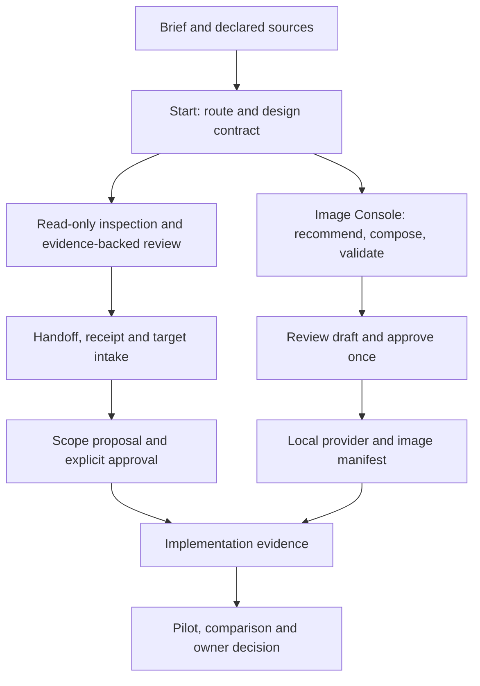

# Architecture

Design AI is a local, source-grounded design-quality layer for coding agents.
Its current-source runtime includes approval-gated review and Image Console
workflows. Implementation and publication status remain separate in the
[completion plan](product-completion-plan.md).

## Four authority layers

```
┌─────────────────────────────────────────────────────────────┐
│  Agent Interface (AGENTS.md, CLAUDE.md)                     │
│  ─ How any LLM picks up this repo and behaves like a senior │
│    designer                                                 │
└─────────────────────────────────────────────────────────────┘
                             ▲
                             │ reads from
                             ▼
┌─────────────────────────────────────────────────────────────┐
│  Skills + Agents + Commands                                 │
│  ─ Task-specific playbooks (skills/)                        │
│  ─ Persona-specific reviewers (agents/)                     │
│  ─ User-invocable shortcuts (commands/)                     │
└─────────────────────────────────────────────────────────────┘
                             ▲
                             │ cites
                             ▼
┌─────────────────────────────────────────────────────────────┐
│  Knowledge Base (knowledge/)                                │
│  ─ Structured, deduplicated, model-readable                 │
│  ─ Generated by tools/extractors/ from refs/                │
│  ─ Hand-written overrides marked with `<!-- hand-written -->`│
└─────────────────────────────────────────────────────────────┘
                             ▲
                             │ derived from
                             ▼
┌─────────────────────────────────────────────────────────────┐
│  Source Material (refs/)                                    │
│  ─ Sparse-cloned upstream design systems                    │
│  ─ READ-ONLY. Never edit.                                   │
│  ─ Refresh via `git -C refs/<repo> pull`                    │
└─────────────────────────────────────────────────────────────┘
```

## Why model-agnostic?

The user invokes design work from multiple agent surfaces (Claude Code, Codex CLI, sometimes Cursor). Knowledge encoded in **markdown + JSON** survives across:

- Claude Code's skill system
- Codex CLI's `AGENTS.md` convention
- Generic prompt context for any LLM

Encoding the same knowledge as Claude-specific skill files would lock it in. We use the skill system for ergonomics, but the **source of truth** is plain markdown.

## Knowledge file contract

Every file under `knowledge/` follows this shape:

```markdown
---
title: <human-readable title>
source: <upstream URL or "hand-written">
extracted_at: <ISO date, omit if hand-written>
applies_to: [<framework or scope tags>]
---

# <title>

<single, focused topic. Under 400 lines.>
```

If a file is generated, it must include the source path so a human can trace it back.

## Extractor contract

Each extractor in `tools/extractors/`:

1. Reads from a single `refs/<source>/` directory.
2. Writes to a single `knowledge/<category>/` directory.
3. Is idempotent — running twice produces the same output.
4. Never overwrites files marked `<!-- hand-written -->`.
5. Documents its source paths in its own header.

## Skill file contract

```
skills/<skill-name>/
├── SKILL.md          # Portable discovery metadata and activation instructions
├── PLAYBOOK.md       # Step-by-step process (read by any agent)
├── TEMPLATE.md       # Output template, if applicable
└── examples/         # Worked examples
```

`SKILL.md` is a thin dispatcher linking directly to `PLAYBOOK.md`, not a copy
of its workflow. Agents read the playbook before executing the skill. Templates,
knowledge references, and examples load only when the playbook requires them.
`npm run skills:check` validates metadata, linkage, workflow sections, line
budgets, and inventory parity across all 21 skills.

## Retrieval without a second authority

Direct file reads and lexical search remain the default. Ranked search in
`cli/lib/search-ranked.mjs` supports opt-in embedding reranking of lexical
candidates through a configured local subprocess provider.

`cli/lib/embedding-index.mjs` owns the derived sidecar. Checkout identity,
learning-file identity, and corpus freshness must match before it is used.
Missing, stale, or failed embedding retrieval returns lexical results with an
explicit notice. Neither vectors nor approved local learning replace the
Markdown corpus or authorize target changes. See [AI learning](AI-LEARNING-PHASE2.md).

## Refresh cadence

| Action | When |
|---|---|
| `git -C refs/<repo> pull` | Monthly, or when a new feature in upstream is referenced |
| `./tools/extractors/run-all.sh` | After any `refs/` update |
| Hand-written `knowledge/` review | Quarterly, or after major ecosystem shifts |

## Runtime and release boundaries

The public product surface and its internal implementation have separate owners:

| Boundary | Source of truth | Responsibility |
|---|---|---|
| Public identities | `cli/lib/capability-manifest.json` | Route, skill, command, agent, MCP tool, and SDK export names |
| Plugin inventory | `.claude-plugin/plugin.json` | Installed Claude assets and package metadata |
| Route catalog | `cli/lib/route-catalog.mjs` | Stable route definitions and route ID validation |
| Route operation | `cli/lib/route-operation.mjs` | Shared read-only route payload assembly for CLI, SDK, and MCP |
| Start operation | `cli/lib/start-operation.mjs` | Shared route, design-contract, review-state, next-step, and effect-boundary assembly for CLI, SDK, MCP, and Console |
| Route engine | `cli/lib/route.mjs` | Scoring, parsing, reference enrichment, and evaluation |
| Design quality contract | `cli/lib/design-quality-report.schema.json` | Versioned evidence, finding, status, permission, and approval shape |
| Design quality validation | `cli/lib/design-quality-contract.mjs` | Dependency-free report validation and derived-summary consistency |
| Website Console source bundle | `docs/website-console/source-bundle.js` | Provenance and revalidation data contract without DOM access |
| Website Console UI | `docs/website-console/app.js` | DOM, storage, graph, copy, and Markdown rendering |
| Image Console gateway | `cli/lib/image-console-server.mjs` | Loopback-only, same-origin HTTP boundary; keeps Prompt Guide secrets server-side |
| Image prompt workflow | `cli/lib/image-workflow.mjs` | Prompt Guide recommend/compose/validate, explicit draft approval, provider ordering, and asset manifest creation |
| Prompt Guide client | `cli/lib/prompt-guide-client.mjs` | Server-only configuration, v1 response validation, bounded HTTP and pinned provenance |
| Image provider adapter | `cli/lib/image-provider.mjs` | Bounded JSON subprocess protocol, isolated environment, timeout and media validation |
| Image asset store | `cli/lib/image-asset-manifest.mjs` | Verified local source descriptors and atomic image/manifest persistence |
| Image Console UI | `docs/image-console/` | Separate responsive generation/editing forms using Website Console token CSS without changing that console |
| Python capability audit | `tools/audit/capability_manifest.py` | Package-independent validation of the canonical identity contract |

The manifest protects names and counts; it does not dispatch runtime behavior. Each
runtime owner keeps an explicit implementation so a metadata change cannot silently
change execution.

The design quality contract is another pure boundary. It does not inspect a target
repository, start a browser, or mutate a file. Future CLI, SDK, MCP, Console, and
browser adapters must produce the same report shape and pass the same validator.
Runtime owners may collect different evidence, but they cannot weaken `unverified`
status or the report's permission boundary.

The start operation is also pure. It reads the design-ai corpus needed to choose a
route and build the existing design contract, but it does not open declared local
paths, fetch repository or page URLs, inspect screenshots, write files, or execute
the returned next command. Website Console accepts only start payloads that retain
that zero-write, zero-target-mutation, zero-external-action performed boundary.

## Artifact ownership

Generated artifacts have distinct write and verification commands:

| Artifact | Generate | Verify without mutation |
|---|---|---|
| `knowledge/COVERAGE.md` | `npm run coverage:generate` | `npm run coverage:check` |
| Documentation staging tree | `tools/build-docs.sh` | `npm run docs:check` builds the final MkDocs site |
| npm tarball | `npm pack` | `npm run package:check`, then `npm run package:smoke` |

Strict audits and release workflows use the verification commands. They must not
repair tracked files as a side effect. This keeps a passing CI run reproducible from
the committed tree and makes stale generated artifacts fail with an actionable
regeneration command.

The npm package intentionally omits clone-only extractors. Its strict audit preserves
that already-verified extractor inventory from the bundled coverage report while
recomputing every packaged knowledge, skill, example, and component section.

`npm run release:preflight` runs every non-publishing release gate except the packed
tarball execution smoke. `npm run release:check` adds that smoke once. Release and
publish workflows run the preflight, build their final tarball, and smoke-test that
same artifact before release or publication.

## Image Console boundary

`design-ai image serve` is intentionally separate from the Website Console, SDK, and MCP. It binds only to a loopback host and serves browser files plus same-origin image routes. The browser has no Prompt Guide key or `Authorization` path; the gateway alone calls the four Prompt Guide endpoints, validates JSON, v1 response version, and pinned provenance, and never keeps a fallback catalog or template body.

Generation and editing first become an in-memory read-only compiled draft. The local provider-neutral subprocess receives one separated JSON input only after explicit approval; a Prompt Guide error, lineage mismatch, invalid draft, or absent editing source creates no job. Generated media and the minimal review manifest are atomically published under the local asset root; the manifest retains prefixed prompt hashes, catalog/template provenance, response version, provider parameters, and edit source IDs but never API secrets or raw provider responses.

## End-to-end product design

The recommended architecture keeps domain contracts shared and transport adapters
thin. It needs no new service, database, dependency, or public command for the
current release. This is a repository design decision, not an upstream pattern.



The image-to-evidence connection is an operator handoff, not an automatic API
bridge. An image manifest proves generation lineage; it does not prove design
quality, legal rights, production suitability, or acceptance by a product owner.

| State | Owner and lifetime | Recovery contract |
| --- | --- | --- |
| Knowledge and public contracts | Versioned repository files | Review source changes and regenerate only owned derivatives |
| Retrieval index | Derived local sidecar | Rebuild explicitly; stale results cannot silently pass as fresh |
| Review, scope, implementation, comparison | Existing file artifacts and digests | Validate exact input lineage; preserve prior receipts |
| Image drafts and jobs | Gateway process memory | Restart loses draft/job state; compose and approve a new draft |
| Image bytes and manifest | Configured local asset root | Persist atomically; revalidate source bytes before editing |
| Local learning | Explicitly approved local profile | No automatic capture, training, or cross-project promotion |

## Extension and acceptance boundaries

P17C source extraction, P17D content quality, P17E visual evaluators, and P17F
continuity reuse the existing review-to-comparison chain. Their detailed entry
and exit criteria live in the [P17 plan](P17-SKILL-AND-CORE-HARDENING-PLAN.md).
They are not implicit v5.2 features. Keep missing evidence `unverified`; do not
substitute an aggregate score for criterion-level proof.

Every UI delivery retains WCAG 2.1 AA contrast, keyboard and visible-focus
coverage, 44 px targets, reduced motion, and responsive evidence. The
[Image Console guide](integrations/prompt-guide-image-prompts.md) owns measured
contrast ratios and the exact current release receipt. Local mock, live provider,
PR CI, and public registry verification are distinct acceptance stages.

## Cross-reference

- [Completion plan](product-completion-plan.md) — sequencing and completion gates
- [Product specialization](PRODUCT-SPECIALIZATION-PLAN.md) — product rationale
- [Product readiness](PRODUCT-READINESS.md) — implementation and adoption status
- [Information architecture](../knowledge/patterns/information-architecture.md) — documentation structure
