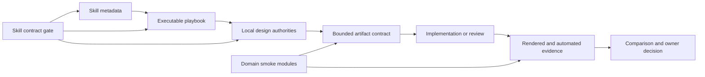

# P17 skill and core hardening plan

## Decision

Strengthen Design AI as a design-quality layer before adding another public CLI,
SDK, MCP, or Website Console surface. The first slice makes the 21 shipped skills
portable, structurally verifiable, and resistant to stale operational guidance.
The next slice reduces the maintenance risk in the oversized smoke harness. New
design capabilities remain evidence-gated and must reuse the existing
review-to-comparison chain.

This is not a pivot toward a visual canvas or a prompt-to-app generator. Design
AI remains responsible for source-grounded judgment, permission boundaries,
implementation handoff, and proof that the delivered result is real.

## Baseline

Snapshot: `main` at `fdb7618` on 2026-08-11.

- Public package: `@design-ai/cli@5.1.0`.
- Installed surface: 21 skills, 16 commands, 4 agents, 29 MCP tools, and 20 SDK
  exports.
- Repository baseline: eight strict corpus audits pass.
- P16 state: external recruitment remains separate, with no candidate, consent,
  participant, result, repeated problem, or adoption claim created by this work.
- The P14 three-slot program baseline and P16 private outreach data are outside
  this change.

## What the repository audit found

| Priority | Finding | Evidence | Decision |
| --- | --- | --- | --- |
| P0 | Skill quality was counted, not validated. | `check-coverage.py` checked `SKILL.md` existence and one verification heading, but not Agent Skills metadata, activation wording, playbook structure, or manifest parity. | Add a deterministic skill contract gate now. |
| P0 | Several durable playbooks contained unstable instructions. | Figma guidance guessed MCP operation names and carried a dated write-capability statement. Design-system QA hard-coded a vendor price. | Replace with active capability/schema detection and current-source checks. |
| P1 | Skill activation metadata did not consistently state when to use the skill. | All 21 descriptions explained the capability, but most lacked an explicit activation condition. | Rewrite descriptions with one concrete `Use when` clause. |
| P1 | Progressive disclosure was implicit and inconsistently described. | `SKILL.md` wrappers linked a playbook but called it “same content,” while the playbook is the actual executable workflow. | Standardize the dispatcher contract without duplicating the playbook. |
| P1 | Release smoke maintenance has become a change-risk hotspot. | `tools/audit/package-smoke.py` is 24,782 lines; one handoff assertion spans more than 2,300 lines. `smoke_assertions.py` is 15,513 lines. | Split by domain after the skill gate, preserving entry points and output. |
| P2 | Source-grounded design-system extraction is not a first-class workflow. | Current skills can build and sync tokens, but there is no staged `verified facts -> closed contract -> generated skill -> mechanical verification` path for a consuming repository. | Design P17C; implement only after fixtures and target ownership are fixed. |
| P2 | UX copy is present as scattered review advice rather than a complete quality lens. | Website review covers content quality and Korean writing knowledge exists, but no canonical interface-copy contract or benchmark exists. | Design P17D as a lens first, not a standalone command. |
| P2 | Objective visual and brand convergence is adapter-dependent. | The browser runner preserves evidence correctly, but it does not ship visual-diff or brand-consistency evaluators. | Design P17E behind the existing adapter and approval boundary. |

## External repository synthesis

The following sources were read as pattern references. No code, assets, tokens,
or templates are copied into Design AI.

| Source | License checked | Useful pattern | Decision |
| --- | --- | --- | --- |
| [Agent Skills specification](https://github.com/agentskills/agentskills) | Apache-2.0 | `SKILL.md` metadata constraints, concise instructions, one-level progressive disclosure, mechanical validation. | **ADAPT** into the local zero-dependency skill gate. |
| [Vercel Labs design-systems-to-agent-skills](https://github.com/vercel-labs/design-systems-to-agent-skills) | MIT | Persisted interview, verified source facts, usage analysis, closed PRD, generation, asset catalog, mechanical verification. | **ADAPT** the source-grounding sequence in P17C. Do not vendor the pipeline. |
| [emilkowalski/skills](https://github.com/emilkowalski/skills) | MIT | Small specialist skills for build, review, improvement plans, opportunity finding, vocabulary, and library choice. | **ADAPT** the narrow task split and self-contained plan format; preserve Design AI evidence rules. |
| [shadcn/improve](https://github.com/shadcn/improve) | MIT | Intent-doc intake, hotspot-weighted audit, plan as an executable handoff, explicit source-mutation boundary. | **ADAPT** for P17 planning and smoke-harness refactors. |
| [Open Design](https://github.com/nexu-io/open-design) | Apache-2.0 | Artifact history, build/test convergence, diff review, and planned visual/brand evaluators. | **DEFER** project continuity and objective evaluators to P17E/P17F. |
| [Open CoDesign](https://github.com/OpenCoworkAI/open-codesign) | MIT | One workspace per design, local-first files as source of truth, lazy capabilities, permissioned commands, multiple exporters. | **DEFER** the application shell; reuse only workspace/history constraints. |
| [StyleSeed](https://github.com/bitjaru/styleseed) | MIT | Design lock plus render/review/revise feedback loop. | **ADAPT** criterion-level gates. **REJECT** a single aggregate quality score because it can hide missing evidence. |
| [UX Writing Skill](https://github.com/content-designer/ux-writing-skill) | MIT | Progressive content patterns, voice contract, accessibility, concrete before/after examples. | **ADAPT** into a source-backed content-quality lens in P17D. |
| [LottieFiles motion-design-skill](https://github.com/LottieFiles/motion-design-skill) | MIT | Philosophy-first motion direction and choreography vocabulary. | **DEFER** as a separate skill because Design AI already owns a deeper motion playbook. Use it only as a future benchmark reference. |

## Target architecture

One concept has one owner:

- `SKILL.md` owns discovery and activation.
- `PLAYBOOK.md` owns the executable workflow.
- `knowledge/`, `docs/`, and `examples/` own detailed authority and worked proof.
- CLI/SDK/MCP adapters own transport, not design meaning.
- Review, browser, implementation, pilot, and comparison artifacts own evidence
  history and permission state.

## Delivery phases

### P17A - Skill contract hardening

Status: implemented in this change.

1. Add one shared Markdown frontmatter helper and reuse it from the existing
   knowledge frontmatter audit.
2. Add `tools/audit/skill-contracts.py` with repository and isolated mutation
   checks.
3. Enforce:
   - Agent Skills name and description rules;
   - explicit `Use when` activation language;
   - direct `SKILL.md -> PLAYBOOK.md` progressive disclosure;
   - playbook input, workflow, source, verification, and done sections;
   - 500-line skill and 400-line playbook budgets;
   - plugin, capability-manifest, and directory parity;
   - rejection of dated capability claims and hard-coded recurring prices.
4. Standardize all 21 skill dispatchers.
5. Replace guessed MCP names with active tool-schema inspection.
6. Run the skill mutation suite and repository check inside
   `release:self-test`.

Exit criteria:

- `npm run skills:self-test` rejects each named negative fixture.
- `npm run skills:check` passes all 21 shipped skills.
- Existing eight corpus audits remain unchanged and green.
- No version, public API, command, SDK export, MCP tool, or npm publication is
  introduced.

Current verification evidence:

- the isolated mutation suite passes;
- all 21 repository skill contracts pass;
- the shared frontmatter parser preserves strict validation across 96 files;
- the complete Node test suite passes 832/832 tests;
- the generated coverage report remains at 181/200 canonical components with 21
  verified skills;
- `npm run release:check` passes eight strict audits, 794 packaged files, the 0/0
  documentation warning policy, SDK smoke, installed-bin smoke, and one-shot
  package smoke.

### P17B - Smoke harness modularization

Status: P17B.3 is the sealed baseline at `695721ba102d3d2f2c2bd0224e862fb0d0198b70`.
P17B.4 extracts only the review contracts and passed the release evidence gate
without a public product contract change.

Current P17B.2 evidence:

- P17B.1 remains the verified contract/validator baseline: 42 `EXPECTED_SITE_*`
  values have one owner in `smoke_domains/site_contracts.py`, while eight shared
  command, probe, and repair validators live in `smoke_domains/site_validators.py`;
- Website Console JSON and Markdown scenario fixtures now live in focused
  `smoke_domains/site_fixtures*.py` modules, including the package-smoke intake,
  evidence, warning, and linked-preview payloads; fixture bytes were compared
  against the P17B.1 source snapshot;
- Website Console output assertions now live in focused responsibility modules,
  which `smoke_assertions.py` imports directly; exact failure-message paths
  remain covered;
- `site_runner.py` is the explicit ordered phase authority for installed-bin and
  one-shot npm Website Console smoke executors; each real command block advances
  its authority, and focused negatives reject missing, duplicate, reordered, and
  unknown phases while retaining separate command factories and coverage;
- the registry smoke keeps the P17B.1 normal Website Console fixture at 4387
  UTF-8 bytes with SHA-256
  `d5ab938931fd3be8c95ac78d7a657f484e6f469ceafa6f0319e53e9155e76f22`;
- the original `smoke_assertions.py`, `package-smoke.py`, and `registry-smoke.py`
  entry points retain their stable callable names, execution paths, and focused
  self-test paths;
- the extracted contract has a byte-stable SHA-256 snapshot and isolated positive
  and negative fixtures;
- baseline parity confirms all 42 values and the command rewrite order are
  unchanged;
- the current snapshot adds 17 new modules and 64 extracted functions; the
  largest new file is 354 lines and the largest extracted function is 163 lines;
  `smoke_assertions.py` is 12,655 lines, `package-smoke.py` is 24,494 lines, and
  `registry-smoke.py` is 9,078 lines;
- pre-extraction focused baselines were 0.42 seconds for shared smoke assertions
  and 0.96 seconds for package-smoke self-tests;
- packed smoke executes 716 commands in the delivered source snapshot; the
  captured command output remains the evidence source for the normalized
  sequence SHA-256
  `0654a8730d42526860bb1d00c16f1c828395ffd0aca448a1f137fcb30fd24a46`;
  observed local wall time was 1,444.11 seconds before and 914.29 seconds after.

Current P17B.3 evidence:

- the exact sealed P17B.2 dirty baseline was applied before extraction from
  SHA-256 `f948c975d51d0138998ce8194ba31e367bd538c10cfcaa87b662bc71bbed486a`;
- `package-smoke.py` directly imports profile, transfer, relevance/eval,
  agent-backlog, skill-proposal report/review, and skill-proposal apply-plan
  responsibilities, while `registry-smoke.py` directly imports its profile,
  transfer, relevance, and eval responsibilities; command execution remains in
  the stable entry points rather than behind a pass-through facade;
- agent-backlog validation is grouped by queue/handoff, runbook/effects, and
  actions/verification; apply-plan validation is grouped by plan identity/tasks,
  command sequence, operator stage/runbook, artifact/evidence, and
  approval/safety, with the original public failure messages retained;
- 30 new learning modules are all below 400 lines: the largest is 394 lines,
  the largest new-module function is 173 lines, and the largest new entry-point
  scenario helper is 184 lines; the entry points are now 12,655 / 20,228 / 7,311
  lines (`smoke_assertions.py` / `package-smoke.py` / `registry-smoke.py`);
- focused smoke assertion, Website Console contract, package-smoke, and
  registry-smoke self-tests pass, as do F821 and Python compilation checks over
  both entry points and every learning module;
- the delivered snapshot passes 832/832 Node tests, eight strict audits, the
  845-file package-content check, documentation policy, release self-tests, and
  packed smoke;
- packed smoke still executes the actual 716-command sequence with normalized
  SHA-256 `0654a8730d42526860bb1d00c16f1c828395ffd0aca448a1f137fcb30fd24a46`;
- the registry Website Console fixture remains exactly 4387 UTF-8 bytes with
  SHA-256 `d5ab938931fd3be8c95ac78d7a657f484e6f469ceafa6f0319e53e9155e76f22`,
  npm remains 5.1.0, and the P16 program remains at SHA-256
  `9ca6d1421c25c30c89fc8dae84752d42770f8e78ed4a41a1df4e071da09b5338`.

Current P17B.4 evidence:

- the committed P17B.3 baseline was verified clean at
  `695721ba102d3d2f2c2bd0224e862fb0d0198b70` before this extraction;
- only inspect, review comparison, P6 review, P7 handoff, P8 receipt, P9
  intake, P10 scope proposal/approval, and their browser-review helpers move
  into responsibility-named review modules; the stable entry points retain
  command execution and public callable names;
- the nine moved callable ASTs, including `review_workflow_digest` and all
  assertion failure-message expressions,
  match the sealed baseline; P11 implementation evidence, P12 pilot evidence,
  learning proposal review, product runtime, SDK smoke, and lifecycle coverage
  stay outside the extraction;
- `review_runner.py` is the narrow ordered phase authority for installed-bin and
  one-shot npm execution: review, handoff, receipt, intake, scope proposal, and
  scope approval each advance at their existing real command block;
- review modules remain below 400 lines, and each new or moved function remains
  at or below 200 lines; package version, P16 digest, registry fixture digest,
  SDK smoke bytes, and the normalized packed command sequence remain unchanged;
- focused self-tests plus 832 Node tests, eight strict audits, the 856-file
  package-content check, documentation policy, release self-tests, and packed
  installed-bin/one-shot npm smoke passed using a disposable local npm cache.

Next domains remain separate and unverified:

1. Extract implementation-evidence contracts as their own domain.
2. Extract pilot contracts only after review and evidence remain stable.
3. Extract install/help/search/route lifecycle contracts last.

Exit criteria:

- No extracted function exceeds 200 lines without a documented reason.
- Each domain module runs independently and through the original entry point.
- Installed-bin and one-shot package smoke remain equivalent.
- Release duration and command count are recorded before and after; no unreviewed
  reduction in coverage is allowed.
- P17B changes only smoke-test architecture and release verification. It adds no
  CLI, SDK, MCP, Website Console runtime, public API, package version, dependency,
  migration, publication, external write, or P16 state change.

### P17C - Source-grounded design-system skill compiler

1. Accept one explicit design-system root and optional consuming repository.
2. Persist scope decisions before reading source.
3. Extract verified token, component, icon, import, variant, and usage facts.
4. Produce a closed generation contract with no invented API names.
5. Generate project-local skill references, never a competing token authority.
6. Verify every path, import, token, and asset against source.

Boundary:

- Start as a clone-only workflow and fixture suite.
- No target write, dependency install, Figma write, commit, push, or publish
  without the existing scope approval chain.
- Promotion to CLI/SDK/MCP requires two independent completed pilot records or a
  new explicit product decision that replaces that evidence rule.

### P17D - Interface content quality

Add content as a ninth review concern only after a contract and fixtures exist.
It must cover purpose, clarity, concision, conversational fit, error recovery,
accessibility, localization, and Korean honorific consistency. It starts as a
knowledge-backed lens inside website and UX review, not a new command.

Exit criteria:

- Buttons, forms, errors, empty states, notifications, onboarding, and destructive
  confirmation each have before/after fixtures.
- Korean and English fixtures preserve product voice and screen-reader meaning.
- No readability score becomes a substitute for user goal or evidence.

### P17E - Objective visual and brand evaluators

Add optional adapter contracts for screenshot regression, responsive overflow,
brand-token drift, and visual diff. Each evaluator must record tool version,
viewport, source digest, threshold, artifacts, and uncertainty. A missing or
invalid artifact remains `unverified`.

### P17F - Project continuity

Build project snapshots from existing review and comparison artifacts rather than
creating a parallel history database. A snapshot links exact source digests,
design contract, approved scope, implementation evidence, comparison, owner
decision, and successor snapshot. Restore remains read-only until separately
approved.

## Selection rule for new public capability

Choose at most one public capability at a time. Rank candidates by:

1. repeated blocking evidence from independent owners;
2. usefulness across CLI, SDK, MCP, and Website Console;
3. ability to preserve exact source and permission history;
4. objective verification strength;
5. maintenance cost and dependency risk.

If evidence does not separate two candidates, improve the existing skill or
knowledge pack instead of widening the public surface.

## Verification

For every P17 implementation PR:

- run the narrow self-test for the changed contract;
- run `npm test` and `npm run audit:strict`;
- run `git diff --check`, `npm run package:check`, and
  `npm run release:self-test`;
- run `npm run docs:check` for documentation changes;
- run `npm run release:check` before merge when packaged behavior changes;
- preserve P16 program and recruitment state unless real external activity
  occurred.

## Rollback

- P17A is additive. Revert the skill gate scripts and dispatcher wording together
  if a supported Agent Skills host proves incompatible.
- P17B keeps stable entry points, so each extracted domain module can be reverted
  independently.
- P17C-P17F remain behind existing approval and evidence boundaries; a failed
  experiment produces no public capability or migration requirement.
