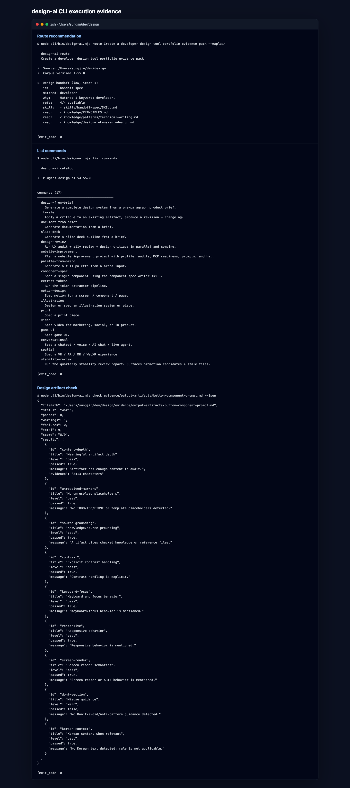
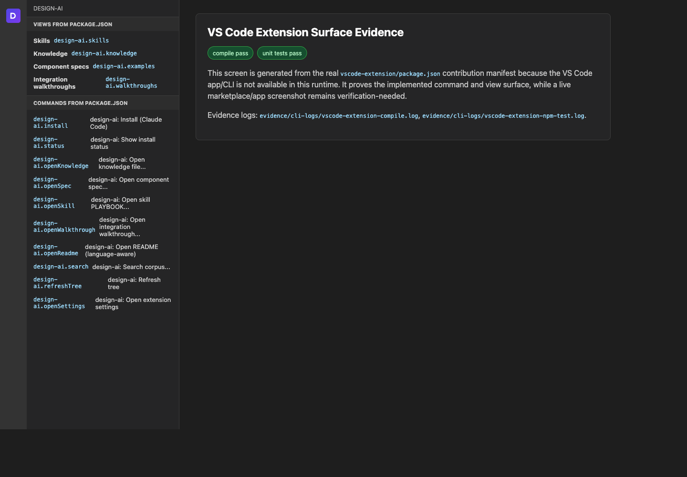
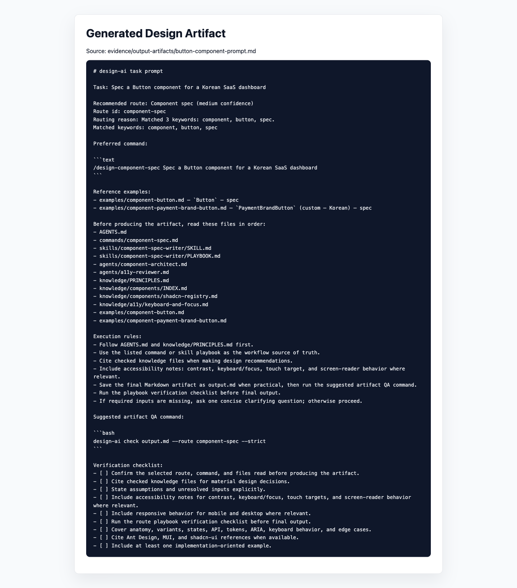
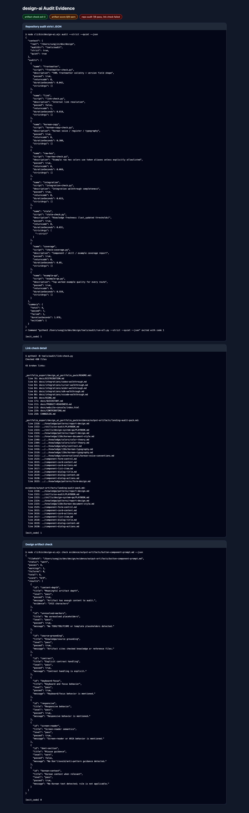
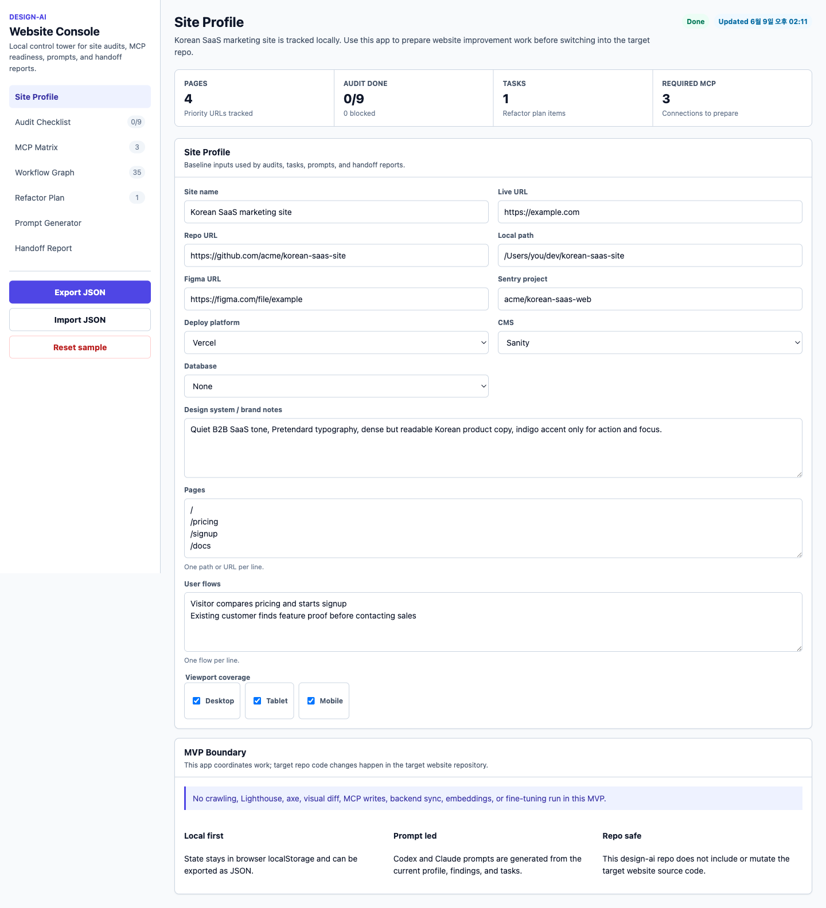

# Evidence Gallery

## 1. Priority Evidence For Developer Design Tool Review

| 우선순위 | 증거 | 파일 | 상태 |
|---|---|---|---|
| 1 | CLI 실행 화면 | `evidence/screenshots/cli-execution-screen.png` | 검증 완료 |
| 2 | Website Console 화면 | `evidence/screenshots/website-console-priority.png` | 검증 완료 |
| 3 | VS Code Extension surface | `evidence/screenshots/vscode-extension-surface-evidence.png` | 조건부 검증 완료 |
| 4 | 생성된 design artifact | `evidence/screenshots/generated-design-artifact.png` | 검증 완료 |
| 5 | audit 결과 | `evidence/screenshots/audit-results-evidence.png` | 부분 통과 / 검증 필요 |

## 1. Website Console

- 증거 파일: `evidence/screenshots/website-console-home.png`
- 접근성 snapshot: `evidence/screenshots/website-console-accessibility-snapshot.md`
- 근거 구현: `docs/website-console/index.html`, `docs/website-console/app.js`, `docs/website-console/styles.css`

## 2. CLI Logs

| 증거 | 파일 | 설명 |
|---|---|---|
| version JSON | `evidence/cli-logs/cli-version-json.log` | CLI/plugin version alignment 확인 |
| help | `evidence/cli-logs/cli-help.log` | public command surface 확인 |
| list skills | `evidence/cli-logs/cli-list-skills.log` | skill catalog 출력 확인 |
| route | `evidence/cli-logs/cli-route-json.log` | brief 기반 workflow recommendation 확인 |
| search | `evidence/cli-logs/cli-search-json.log` | knowledge corpus search 확인 |
| prompt | `evidence/cli-logs/cli-prompt-output.log` | prompt artifact 생성 확인 |
| pack | `evidence/cli-logs/cli-pack-output.log` | packed context artifact 생성 확인 |
| site sample | `evidence/cli-logs/cli-site-sample.log` | Website Console sample workspace 생성 확인 |
| site next actions | `evidence/cli-logs/cli-site-next-actions.log` | Website Console next action artifact 생성 확인 |
| npm test | `evidence/cli-logs/npm-test.log` | 302 tests pass 확인 |

## 3. Output Artifacts

| 산출물 | 파일 | 설명 |
|---|---|---|
| Button prompt | `evidence/output-artifacts/button-component-prompt.md` | component spec prompt 생성 결과 |
| Landing audit pack | `evidence/output-artifacts/landing-audit-pack.md` | accessibility/responsive UX audit pack 생성 결과 |
| Website workspace sample | `evidence/output-artifacts/website-workspace-sample.json` | Website Console sample JSON |
| Website next actions | `evidence/output-artifacts/website-next-actions.md` | Website Console next-action Markdown |

## 4. Architecture Evidence

| 다이어그램 | 파일 |
|---|---|
| Current architecture | `evidence/architecture/current-architecture.md` |
| CLI sequence | `evidence/architecture/cli-sequence.md` |
