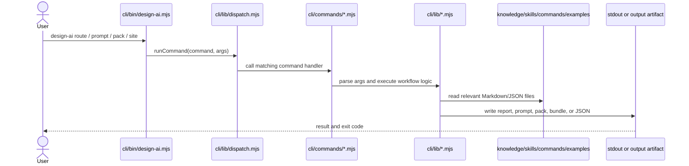

# CLI Sequence Evidence

## Verified in this evidence run

- `evidence/cli-logs/cli-version-json.log`
- `evidence/cli-logs/cli-route-json.log`
- `evidence/cli-logs/cli-prompt-output.log`
- `evidence/cli-logs/cli-pack-output.log`
- `evidence/cli-logs/cli-site-sample.log`
- `evidence/cli-logs/cli-site-next-actions.log`
