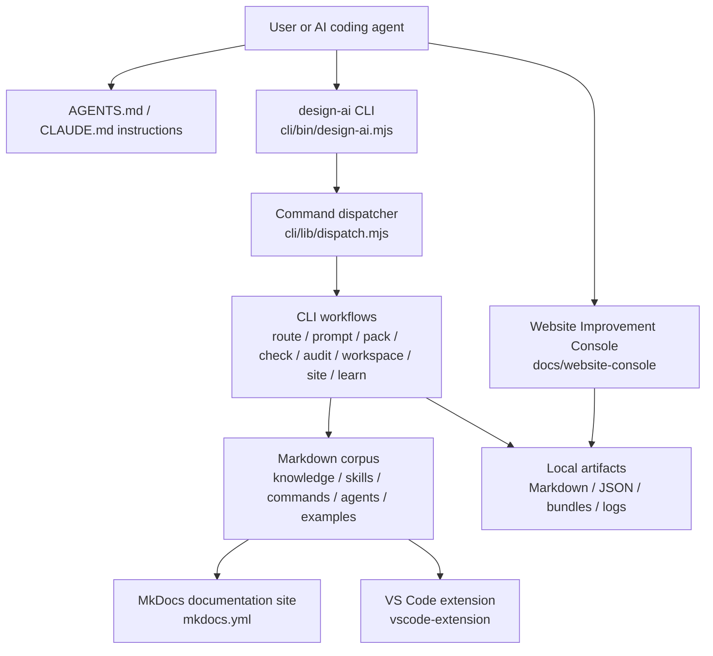

# Current Architecture Evidence

## Evidence files

- `cli/bin/design-ai.mjs`
- `cli/lib/dispatch.mjs`
- `cli/commands/*.mjs`
- `cli/lib/*.mjs`
- `knowledge/`
- `skills/`
- `commands/`
- `examples/`
- `docs/website-console/index.html`
- `docs/website-console/app.js`
- `mkdocs.yml`
- `vscode-extension/package.json`
