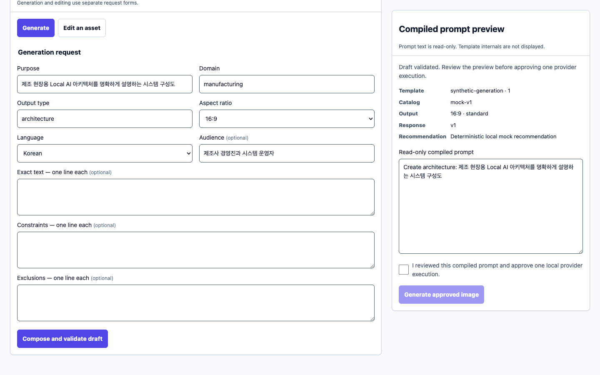
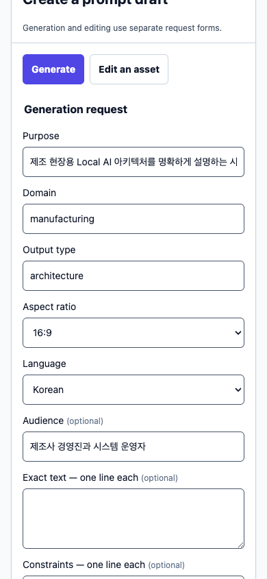
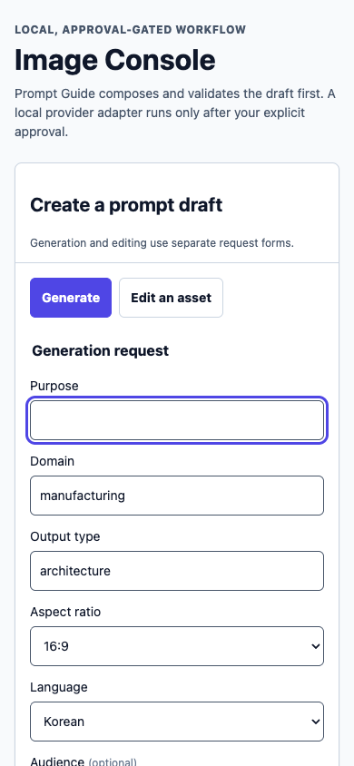

# Image Console browser QA receipt

- Date: 2026-09-04 (Asia/Seoul)
- Source baseline: local `17f7b89` checkout with the current unreleased v5.2.0
  Image Console release-candidate delta
- Environment: macOS 26.6.2 (25G83), Node 24.18.0, Python 3.12.12
- Browser automation: Playwright Chromium through the repository's supported
  wrapper
- Server: loopback-only `http://127.0.0.1:4318`
- Mode: `PROMPT_GUIDE_MODE=mock`, `NODE_ENV=test`

This is source-repository evidence, not published v5.1.0 evidence. It validates
the local browser surface and mock Prompt Guide composition path. Automated
package smoke separately owns the deterministic approved-provider adapter path.

## Result

The mock browser flow passed for composition, validation, explicit approval
gating, responsive layout, keyboard navigation, visible focus, reduced motion,
and checked color contrast. The intentional provider attempt failed closed with
HTTP 503 because no provider command was configured; the UI surfaced both a
status update and an assertive error instead of implying that an image existed.

No `PROMPT_GUIDE_*` or `IMAGE_PROVIDER_*` environment variable was available
for live integration. Variable names were checked without reading or recording
secret values. A live Prompt Guide call and real generation/edit provider run
therefore remain unverified external gates.

## Scenario coverage

| Area | Observation | Result |
| --- | --- | --- |
| Initial semantics | Skip link, `main`, named region, tablist, tabpanel, fieldset, labels, status, and alert were exposed | Pass |
| Draft workflow | Filled Korean purpose and audience; mock compose/validate returned a synthetic-generation v1 draft with mock-v1 and 16:9 standard output | Pass |
| Approval gate | Approval checkbox was disabled before a draft; Generate remained disabled until the operator explicitly checked approval | Pass |
| Missing provider | Approved execution returned HTTP 503, status said to compose a new draft, and alert said `Image provider execution is not configured` | Pass, expected failure |
| Desktop layout | 1440 px viewport; document, body, and inner width were all 1440 px | Pass, no horizontal overflow |
| Mobile layout | 390 px viewport; document, body, and inner width were all 390 px | Pass, no horizontal overflow |
| Keyboard entry | First `Tab` focused `Skip to Image Console`; `Enter` moved focus to `main` | Pass |
| Tabs | From the Generate tab, `ArrowRight` selected Edit an asset and displayed its panel | Pass |
| Focus and target | Purpose input showed a 3 px solid `rgb(79, 70, 229)` outline; computed minimum height was 44 px | Pass |
| Reduced motion | With `prefers-reduced-motion: reduce`, transition and animation durations resolved to `0.00001s` | Pass |
| Browser console | Zero warnings/errors before the intentional missing-provider request | Pass |

## Contrast checks

| Foreground / background | Ratio | WCAG 2.1 AA result |
| --- | ---: | --- |
| `#4f46e5` / `#ffffff` | 6.29:1 | Pass for normal text and UI |
| `#4f46e5` / `#f8fafc` | 6.01:1 | Pass for normal text and UI |
| `#475569` / `#ffffff` | 7.58:1 | Pass for normal text and UI |
| `#0f172a` / `#ffffff` | 17.85:1 | Pass for normal text and UI |

## Package receipt

The final package-content check after the release-facing documentation and
metadata guard edits reported 880 files, 2,698,721 packed bytes, and 11,799,376
unpacked bytes. It reported no missing files, forbidden files, Markdown-link
errors, or other errors. This measurement lives outside the package so recording
it cannot change the artifact it describes.

## Screenshots

### Desktop, 1440 × 900

SHA-256:
`d948f0cd7414bbd7e85073e40dbfe1b239f8363268e276bdc098a06c4d86fcfd`

### Mobile, 390 × 844

SHA-256:
`ab33f05d02003a3dcfbf9818fd465adaca275381e77f7170598f2d7d622bc5ad`

### Mobile keyboard focus

SHA-256:
`f7271dca70dd482e1cd01636e4d236d43355afb37b013711f5a7878a15f70850`

## Boundary

This QA performed no target-repository mutation, external write, Prompt Guide
network call, real provider invocation, commit, push, release, or publication.
The receipt is tied to the listed local baseline plus its unreleased working-tree
delta; a future integrated commit and CI run must provide immutable release
identity before publication.
